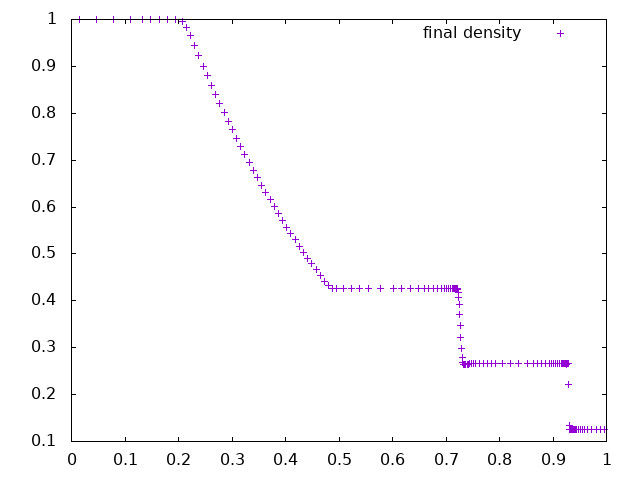

# Visualizing the simulation results

We will now run our first simulation. In principle, we have compiled the code for `NDIM=1` without MPI, obtaining in the `ramses/bin` directory the executable called `ramses1d`. 

In order to use it, we need a parameter file. There are plenty of examples in directory `ramses/namelist`. In the Terminal window, type the following:
```
pwd
```
It should reply this:
```
/home/your_login_name/ramses
```
Otherwise, go to the correct folder using comand `cd`. Then type:
```
bin/ramses1d namelist/tube1d.nml
```

You should see the program running and outputting a load of data to screen. It is more convenient to redirect the standard output from the screen to a file. For this, type:

```
bin/ramses1d namelist/tube1d.nml > run.log
```

This create a new file called `run.log` that you can store for later and examine by typing:

```
more run.log
```
It should start with:

```
 _/_/_/       _/_/     _/    _/    _/_/_/   _/_/_/_/    _/_/_/
 _/    _/    _/  _/    _/_/_/_/   _/    _/  _/         _/    _/
 _/    _/   _/    _/   _/ _/ _/   _/        _/         _/
 _/_/_/     _/_/_/_/   _/    _/     _/_/    _/_/_/       _/_/
 _/    _/   _/    _/   _/    _/         _/  _/               _/
 _/    _/   _/    _/   _/    _/   _/    _/  _/         _/    _/
 _/    _/   _/    _/   _/    _/    _/_/_/   _/_/_/_/    _/_/_/
                         Version 3.0
        written by Romain Teyssier (Princeton University)
            (c) CEA 1999-2007, UZH 2008-2021, PU 2022

 Working with nproc =     1 for ndim = 1
 Using solver = hydro with nvar =  3

 compile date = 06/06/23-16:37:05
 patch dir    =
 remote repo  = https://bitbucket.org/rteyssie/ramses
 local branch = master
 last commit  = ebcb6769fb9fd7234a969afec2c82afb176f9903

 Building initial AMR grid
 Initial mesh structure
 Level  1 has          1 grids (       1,       1,       1,)
 Level  2 has          2 grids (       2,       2,       2,)
 Level  3 has          4 grids (       4,       4,       4,)
 Level  4 has          8 grids (       8,       8,       8,)
 Level  5 has          8 grids (       8,       8,       8,)
 Level  6 has          8 grids (       8,       8,       8,)
 Level  7 has          8 grids (       8,       8,       8,)
 Level  8 has          8 grids (       8,       8,       8,)
 Level  9 has          6 grids (       6,       6,       6,)
 Level 10 has          4 grids (       4,       4,       4,)
 Starting time integration
 Output    58 cells
 ================================================
 lev      x           d          u          P
  4  3.12500E-02  1.000E+00  0.000E+00  1.000E+00
  4  9.37500E-02  1.000E+00  0.000E+00  1.000E+00
  4  1.56250E-01  1.000E+00  0.000E+00  1.000E+00
  4  2.18750E-01  1.000E+00  0.000E+00  1.000E+00
```
If you see the same output, you are good. If not, then something went wrong in the previous steps and you should try again.

We will now try and visualize the results using a nice plotting routine.

First we try with `python`. For this, you can follow the instructions [here](https://wiki.flatironinstitute.org/SCC/JupyterHub) on how to launch a `jupyter notebook` on a `rusty` compute node.

Once you have opened a Jupyter Notebook on `rusty`, type the following cells:
```
import numpy as np
import matplotlib.pyplot as plt
from astropy.io import ascii
```
```
!grep -n Output run.log > /tmp/out.txt
lines = ascii.read("/tmp/out.txt")
i = int(lines["col1"][-1][:-1])
n = int(lines["col3"][-1])
```
```
data = ascii.read("run.log",header_start=i-2,data_start=i-1,data_end=i+n-1)  
```
```
plt.plot(data["x"],data["d"])
```
![image][profile1.png]

You should see the density profile of this famous 1D test called Sod's test. Note that you may have to import beforehand the following packages for this example to work: `numpy`, `matplotlib` and `astropy`. 

We can do the same using the `gnuplot` package directly within the Linux operating system. For this, type in the Terminal window on `rusty`:
```
gnuplot
```
You are now inside the `gnuplot` program. You can now type:
```
gnuplot> plot "run.log" every ::::1000 u 2:3 title "initial density"
gnuplot> replot "run.log" every ::1000 u 2:3 title "final density"
```
You should see two density profiles, one corresponding to the initial conditions and the final one, similar to what you got using `python`. 

The real power of `gnuplot` is that it can be used directly on the command line. For example, after having first exited `gnuplot`, type directly in the Terminal window:

```
gnuplot -e "set term jpeg; plot 'run.log' every ::1000 u 2:3 title 'final density' " > density.jpeg
```
This will create an image called `density.jpeg` that you can see using your Web browser on `adroit`. 




[profile1.png]: profile1.png
